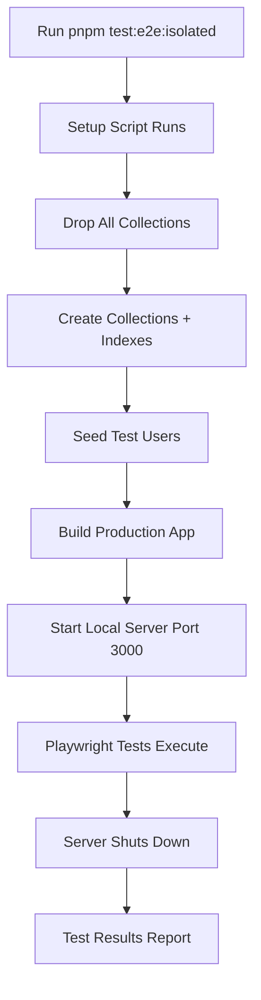

# E2E Testing Setup - Isolated Environment

## Overview
This project uses **completely isolated E2E testing** to ensure:

- ✅ No interference with development or production data
- ✅ Consistent, repeatable test results
- ✅ Safe to run locally and in CI/CD
- ✅ Fast, parallelizable tests

## Architecture

### Test Environment Isolation

```
Production Environment     Development Environment     E2E Test Environment
==================        ======================      ====================
MongoDB Atlas (Prod)      MongoDB Atlas (Dev)         Local MongoDB
  - Real user data          - Dev/test data             - E2E test data ONLY
  - Port: 27017             - Port: 27017               - Port: 27017
  - DB: production          - DB: development           - DB: e2e_test

Production Build          Development Build           Production Build (Local)
  - Deployed to Vercel      - Local dev server          - Optimized code
  - Production URLs         - Hot reload enabled        - Runs locally
                                                        - Test credentials only
```

### Key Safety Features

1. **Separate Database**: Uses `mongodb://127.0.0.1:27017/e2e_test` - completely isolated
2. **Test Credentials**: Hardcoded test-only secrets (never use real credentials)
3. **Disabled External Services**: Email, Redis, OAuth providers are mocked/disabled
4. **Clean State**: Database is wiped and reseeded before each test run

## Configuration Files

### `.env.e2e` - E2E Environment Variables
Isolated test configuration with:
- Local MongoDB connection
- Test-only authentication secrets
- Disabled external services
- Mock Sanity CMS project

### `playwright.config.ts` - Test Runner Config
- Uses **production build** for realistic testing
- Starts local server with E2E environment
- 180-second timeout for build + startup
- Headless browser testing

### `tests/setup-e2e-db.mjs` - Database Setup Script
- Drops all existing collections
- Creates fresh indexes
- Seeds test users (regular + admin)
- Ensures clean slate for tests

## Quick Start

### 1. Run E2E Tests with Full Setup
```bash
# This will:
# 1. Clean/setup the database
# 2. Build the production app
# 3. Run all E2E tests
pnpm test:e2e:isolated
```

### 2. Run E2E Tests Only (Database Already Set Up)
```bash
pnpm test:e2e
```

### 3. Debug E2E Tests Interactively
```bash
# Opens Playwright Inspector for step-by-step debugging
pnpm test:e2e:debug
```

### 4. Use Playwright UI Mode
```bash
# Opens Playwright's UI for visual test running
pnpm test:e2e:ui
```

### 5. Clean E2E Database
```bash
# Wipe and reseed the database
pnpm e2e:clean
```

## Test Users

The following test users are created by `tests/setup-e2e-db.mjs` with valid bcrypt-hashed passwords:

### Admin User
- **Email**: `admin@example.com`
- **Password**: `TestSecurePass123!`
- **Role**: `admin`

### Regular User  
- **Email**: `e2e-test@example.com`
- **Password**: `TestSecurePass123!`
- **Role**: `user`

### Venue Owner
- **Email**: `venue@example.com`
- **Password**: `TestSecurePass123!`
- **Role**: `venue_owner`

### Additional Test User
- **Email**: `user@example.com`
- **Password**: `password123`
- **Role**: `user`

> **Note**: These credentials are configured in `tmp/playwright-local.env` via `E2E_ADMIN_EMAIL`, `E2E_USER_EMAIL`, etc.

## How It Works

### 1. Initial Setup (One Time)
```bash
# Ensure MongoDB is running locally
# Or tests will use in-memory MongoDB
pnpm e2e:setup
```

### 2. Running Tests


### 3. What Gets Tested
The E2E tests cover 200+ scenarios across:
- Authentication & Authorization (Login, Registration, RBAC)
- Admin Dashboard (Analytics, Moderation)
- API Endpoints (REST APIs, Error Handling)
- Search & Filtering
- Listing Details & Reviews
- City Pages & Maps
- Responsive Navigation
- Cross-Browser Compatibility
- Accessibility

## Common Issues & Solutions

### Issue: MongoDB Connection Error
**Symptom**: `ECONNREFUSED 127.0.0.1:27017`

**Solution**: Ensure MongoDB is running locally:
```bash
# macOS (Homebrew)
brew services start mongodb-community

# Linux (systemd)
sudo systemctl start mongod

# Or use Docker
docker run -d -p 27017:27017 mongo:latest
```

### Issue: Port 3000 Already in Use
**Symptom**: `EADDRINUSE :::3000`

**Solution**: Kill the process using port 3000:
```bash
lsof -ti:3000 | xargs kill -9
```

### Issue: Build Fails
**Symptom**: Webpack/TypeScript errors during `pnpm build`

**Solution**: Ensure dependencies are installed:
```bash
pnpm install
pnpm build
```

### Issue: Tests Timeout
**Symptom**: Tests fail with timeout errors

**Solution**: The first run builds the app (takes ~30s). Subsequent runs reuse the build:
```bash
# First run - slow (builds app)
pnpm test:e2e  # Takes ~2 minutes

# Subsequent runs - fast (reuses build)
pnpm test:e2e  # Takes ~30 seconds
```

## CI/CD Integration

### GitHub Actions Example
```yaml
name: E2E Tests

on: [push, pull_request]

jobs:
  e2e:
    runs-on: ubuntu-latest
    
    services:
      mongodb:
        image: mongo:7.0
        ports:
          - 27017:27017
    
    steps:
      - uses: actions/checkout@v4
      - uses: pnpm/action-setup@v2
      - uses: actions/setup-node@v4
        with:
          node-version: '20'
          cache: 'pnpm'
      
      - name: Install dependencies
        run: pnpm install
      
      - name: Install Playwright browsers
        run: pnpm install:playwright:ci
      
      - name: Run E2E tests
        run: pnpm test:e2e:isolated
      
      - name: Upload test results
        if: always()
        uses: actions/upload-artifact@v4
        with:
          name: playwright-report
          path: playwright-report/
```

## Best Practices

### 1. Always Use Isolated Setup
```bash
# Good - Ensures clean state
pnpm test:e2e:isolated

# Risky - May have stale data
pnpm test:e2e
```

### 2. Never Use Real Credentials
The `.env.e2e` file has test-only credentials. Never put production secrets here.

### 3. Keep Tests Independent
Each test should:
- Set up its own data
- Clean up after itself
- Not depend on other tests' state

### 4. Use Page Objects
Structure tests using the Page Object pattern for maintainability.

## Maintenance

### Adding New Test Data
Edit `tests/setup-e2e-db.mjs` to add new seed data:

```javascript
// Add new test listing
await db.collection('listings').insertOne({
  title: 'Test Eco Cafe',
  slug: 'test-eco-cafe',
  city: 'Test City',
  // ... other fields
});
```

### Updating Test Users
Modify the user seeds in `setup-e2e-db.mjs`:

```javascript
const testUser = {
  email: 'new-test@example.com',
  // ... updated fields
};
```

## Security Notes

⚠️ **Important**: The E2E environment is for **testing only**

- Test secrets are **hardcoded** and **not secure**
- Test database is **wiped** before each run
- **Never** use real user data or credentials
- **Never** point E2E tests at production databases

## Troubleshooting

### View Detailed Logs
```bash
# Show server output
DEBUG=pw:webserver pnpm test:e2e

# Show Playwright debug logs
DEBUG=pw:api pnpm test:e2e
```

### Run Single Test File
```bash
pnpm exec playwright test tests/e2e/auth.spec.ts
```

### Run Specific Test
```bash
pnpm exec playwright test -g "login with valid credentials"
```

---

**Last Updated**: 2025-11-24  
**Status**: ✅ Fully Isolated E2E Environment
