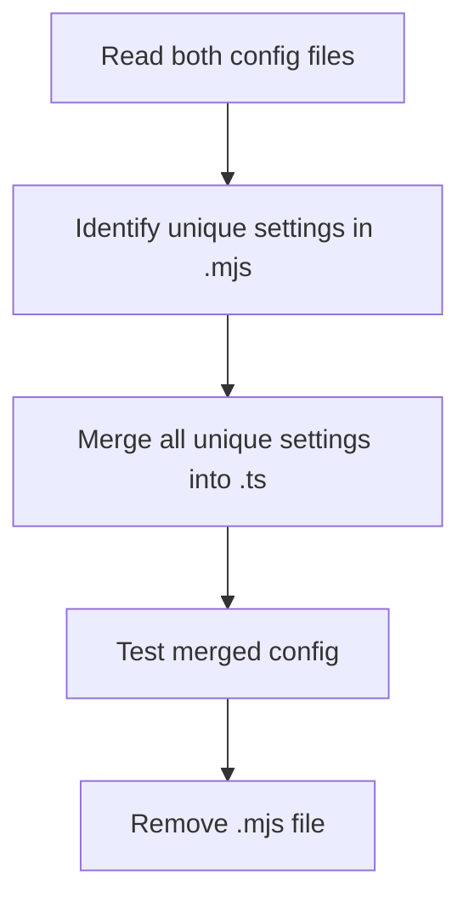

# Plan: Consolidating `next.config.mjs` and `next.config.ts`

## Objective

Unify all Next.js configuration into a single, comprehensive TypeScript config file, ensuring no settings or functionality are lost.

---

## Steps

1. **Identify Unique Settings**
   - Extract all settings, plugins, and customizations from both `next.config.mjs` and `next.config.ts`.
   - List all unique configurations present in `.mjs` but missing in `.ts`.

2. **Merge Configurations**
   - Add missing top-level keys from `.mjs` to `.ts`:
     - `poweredByHeader`, `compress`, `reactStrictMode`
     - Full `images` config: `formats`, `minimumCacheTTL`, `deviceSizes`, `imageSizes`, `remotePatterns`, and merge `domains`
     - `serverExternalPackages`, `compiler`
   - Combine both custom webpack rules:
     - `.csv` loader (from `.mjs`)
     - SVGR loader (from `.ts`)

3. **TypeScript Compatibility**
   - Ensure all config uses valid TypeScript syntax and types.
   - Use correct types for `webpack` config and loaders.

4. **Testing**
   - Run `next build` and/or `next dev` to verify the merged config works.
   - Test image optimization, SVG import, CSV import, styled-components, and external packages.

5. **Cleanup**
   - Once verified, delete `next.config.mjs` to avoid conflicts.

---

## Mermaid Diagram

---

## Notes

- All settings from both files will be preserved.
- The merged config will be fully TypeScript-compatible.
- Testing is critical before removing the `.mjs` file.
